# NS-project
神经科学项目

成员：陈子昂 王坤明 刘瀚中

# 使用说明
1. 将视频放在与`slowfast.ipynb`同级文件夹下并修改`video_path`与其对应
2. 根据视频中动作开始时间与持续时间调整`start_sec`,`frames_per_second`使其大致满足`start_sec`对应动作开始时间，`64/frames_per_second`大致等于动作持续时间

# 代码环境
需要安装`pytorch`,之后使用`pip`安装`pytorchvideo`

# 结果展示

## Playing Basketball:

## Vault:

## Eating Burger:

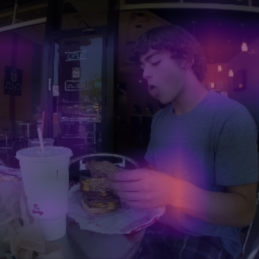

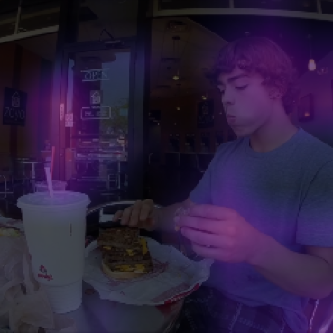

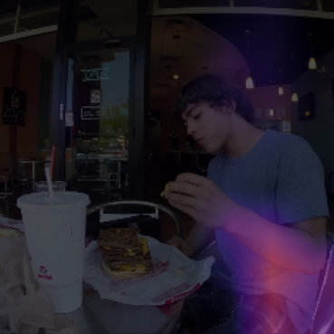

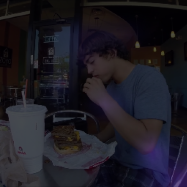

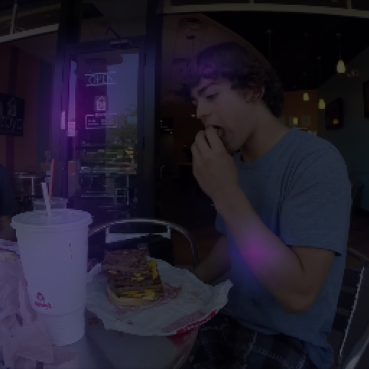

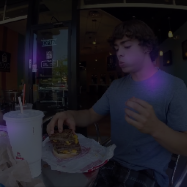

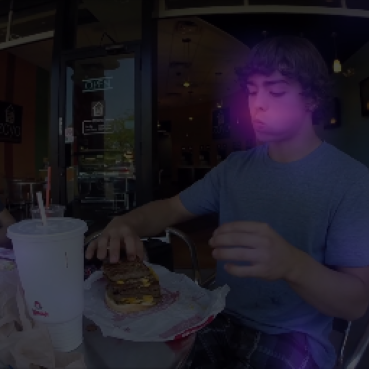

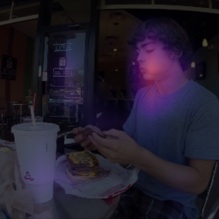

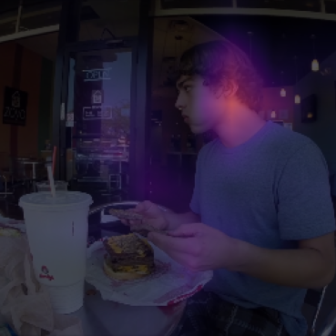

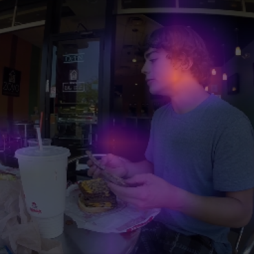

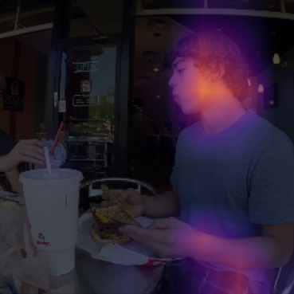

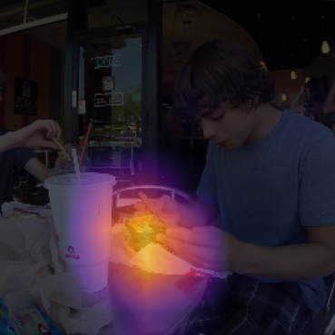

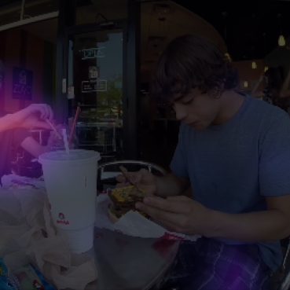

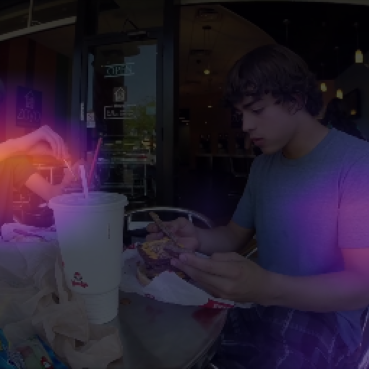

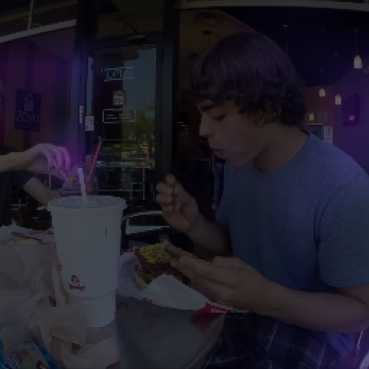

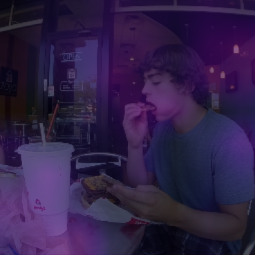

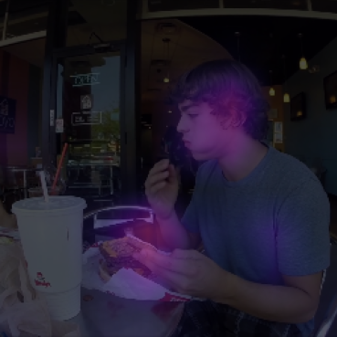

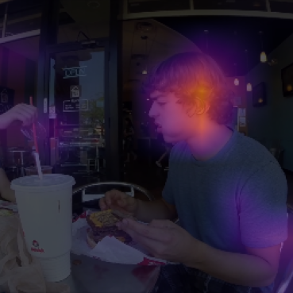

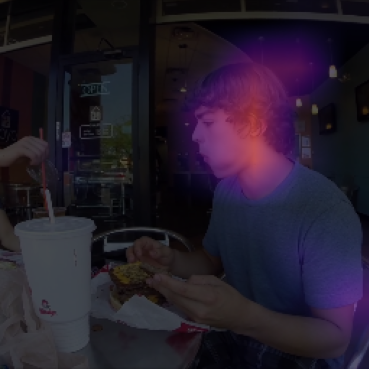

